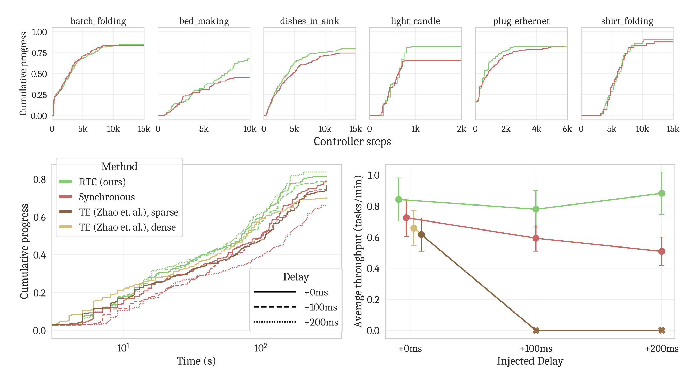

:: title ::

  

    3
  

  
  <h1 class="!m-0 leading-none border-none">
    Real-world impact
  </h1>

:: content ::

<strong class="text-[#92400e]">
Setup
Benchmark
</strong>

= 5 ? 'opacity-0 pointer-events-none' : 'opacity-100'">
<ul class="list-disc list-inside text-gray-700 dark:text-gray-300 space-y-2">
<li v-click="1">

<strong class="text-[#92400e]">Model:</strong> policy 

<Rough type="circle" color="#92400e" :show="$nav.clicks >= 2" class="relative">

$\pi_{0.5}$ 

</Rough>

$(H = 50, \Delta t = 20\text{ms})$ with $n = 5$ denoising steps.

</li>

<li v-click="3">

<strong class="text-[#92400e]">Initial latency:</strong> 76ms (baseline) vs 97ms (RTC) + 10-20ms of LAN network overhead 

$(d \approx 6)$ for RTC.

</li>

<li v-click="4">

<strong class="text-[#92400e]">Stress Test:</strong> injected latency of +100ms 

$(d \approx 11)$ and +200ms $(d \approx 16)$ to simulate remote cloud servers or scaled models.

</li>
</ul>

Fig. 4 — Black et al. (2025)

<strong>Spacer</strong>

<video src="https://website.pi-asset.com/real_time_chunking/sizzle.mp4" autoplay loop muted playsinline class="w-full rounded-xl shadow-lg border border-gray-200 dark:border-gray-700"></video>

